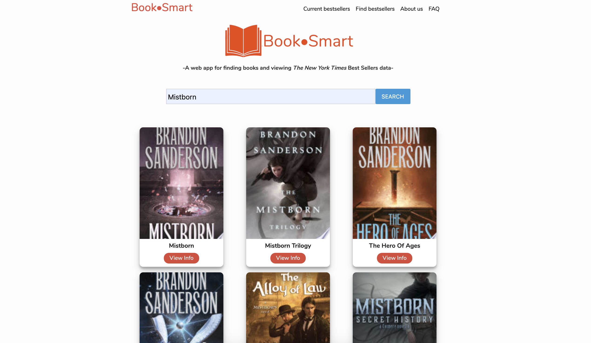
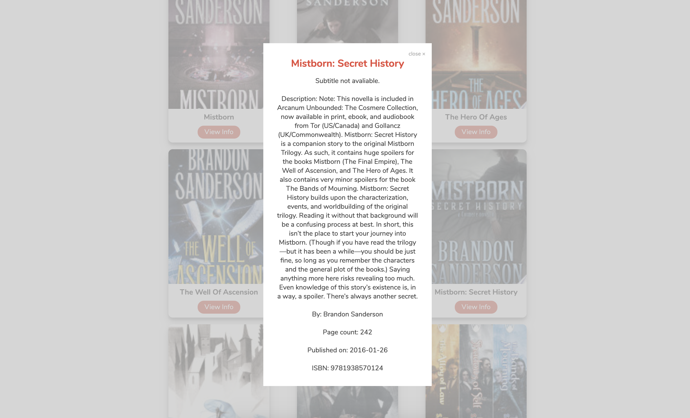
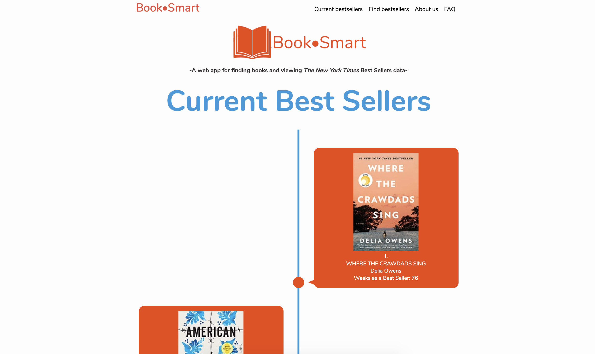
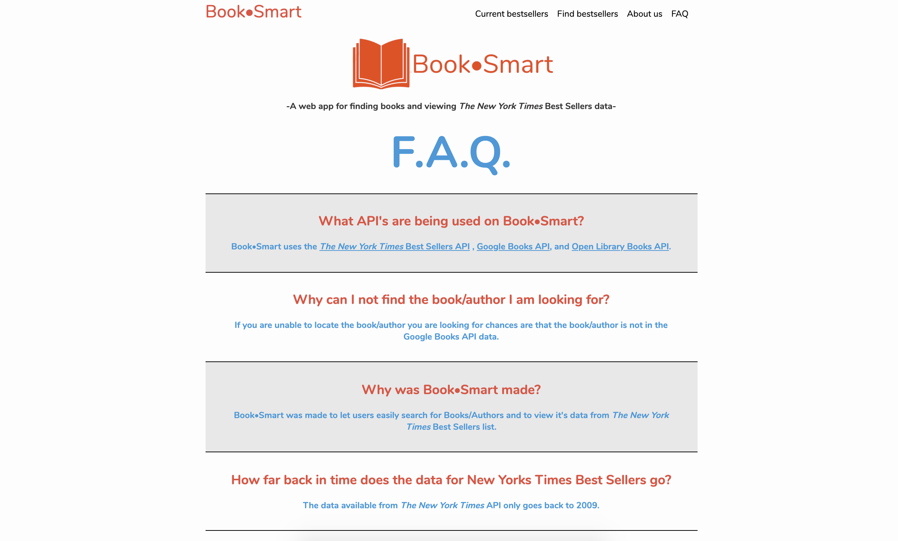

<h1>Book•Smart<h1>


<h2><u>Overview:</u><h2>
<h4>Book•Smart allows users to search for books and view both current and historical bestseller data from <em>The New York Times</em>. Book•Smart was designed with functionality, responsiveness, and amsmooth user experience at the forefront. This web application is for book lovers who want to find more information about specific titles, and their respective bestseller history (or lack thereof). Our final product allows the user to search for any book and returns an interactive gallery of titles with the ability to fetch more information about selected titles. Additional features include the ability to see current bestsellers from <em>The New York Times</em>, as well as viewing bestsellers on dates specified by the user. In the future, we would like to incorporate a backend server and database, which will allow the user to create a profile, login, and keep track of books they're interested in or have read. We would also like to implement other APIs which will allow the user to see reviews, and be recommended similar titles (i.e. Goodreads, etc.).</h4>

</br>

<h2><u>The Team:</u></h2>

<h3>Austin Denny: https://github.com/abdenny</h3>
<b>Primary team role:</b> APIs, JavaScript writer, Scrum/Agile, prototype/concepting
</br>
<b>Contributions:</b> JavaScript for all pages, which entailed designing and manipulating HTML & CSS as necessary. Implemented our stretch goal of allowing users to search for bestseller data on specific dates and displaying those on the specificbook page. Developed JavaScript functions to efficiently obtain information from three different APIs, which involved passing information retrieved from one API to another.

<h3>Jaye Jensen: https://github.com/jaye-j</h3>
<b>Primary team role:</b> Front-end formatting and styling, Graphic Designer, Scrum/Agile, prototype/concepting,
</br>

<b>Contributions:</b>  HTML and CSS for all pages. Implemented JavaScript necessary for animations on the home, current bestsellers, and find bestsellers pages. Designed logos, the color scheme, and ensured consistent design throughout the website. Executed our stretch goals of having an 'About us' and 'FAQ' page.

<h3>Meryem Komur: https://github.com/meryemkmr</h3>
<b>Primary team role:</b> Front-end markup and styling, prototype/concepting
</br>
<b>Contributions:</b> Main focus was HTML, CSS, and Design. Designed a more traditional desktop version that implements jQuery and Bootstrap4. Deployed responsive design while collaborating with team as well as consistent design throughout all desktop pages, navigation, and footers.


</br>
</br>
<h2><u>What we used:</u></h3>
<h3>Languages:</h3>
<ul>
    <li>HTML5</li>
    <li>CSS3</li>
    <li>JavaScript ES6</li>
</ul>

<h3>APIs</h3>
<ul>
    <li><em>The New York Times</em> Best Sellers API - https://developer.nytimes.com/docs/books-product/1/overview</li>
    <li>Google Books API - https://developers.google.com/books</li>
    <li>Open Library Books API - https://openlibrary.org/dev/docs/api/books</li>
</ul

<h3>Other:</h3>
<ul>
    <li>AJAX</li>
    <li>JSON</li>
    <li>Photoshop</li>
</ul>

</br>

<h2><u>MVP (Minimum Viable Product):</u></h2>
<ul>
    <li>Book search gallery which returns relevant titles</li>
    <li>On-click, displays specific information about that title</li>
    <li>Display current bestseller data from <em>The New York Times</em></li>
    <li>Responsive design</li>
</ul>

</br>

<h2><u>Stretch Goals Completed</u></h2>
<ul>
    <li>Implementing a third API to dynamically add covers</li>
    <li>Adding Aboutus and FAQ pages</li>
    <li>Implementing the ability to search for bestseller data on specific dates</li>
</ul>

<h2><u>Stretch Goals Future</u></h2>
<ul>
<li>Creating a PostgreSQL database allowing users to create a profile, login, and keep track of books. Implement other APIs show reviews and recommended similar titles.</li>
<li>Implementing the traditonal desktop design and the ability to toggle between views.</li>
</ul>

</br>

<h2><u>Challenges & Solutions:</u><h2>
<h3>Some of the biggest challenges we faced with this project build included:</h2>

<b>Challenge:</b> Inconsistent formatting in APIs. Often paths would change arbitrarily, making it difficult to programmatically drill down required data.
</br>
<b>Solution:</b> Learned much more about our specific APIs through trial and error. Implemented try/catches for when data fetches may fail.

<b>Challenge:</b> JavaScript often executed asynchronusly.
</br>
<b>Solution:</b> Solving this issue require apporpiately using promises in conjuction with fetches.

<b>Challenge:</b> Making the site responsive for all device sizes.
</br>
<b>Solution:</b> After research, along with trial and error, we determined that CSS grid was the best/most responsive layout for our website.

</br>

<h2><u>Code Snippets:</u></h2>

<h4>Showcases how we fetched when a title was searched from the Google Books API.</h4>

```javascript
//Event listener on the search button.
searchButton.addEventListener('click', e => {
  e.preventDefault();
  valuableGoogleObjects2 = [];
  let input = document.querySelector('#input').value;
  let userInput = input;
  let googleBookUrl = 'https://www.googleapis.com/books/v1/volumes?q=';
  // Takes the user input and inserts into the URL of the API call.
  fetch(googleBookUrl + `${userInput}` + googleBookKey)
    .then(response => {
      return response.json();
    })
    .then(json => {
      initialGoogleObjects.push(json);
    })
    .then(() => {
      // Takes the returned object from the API call and parses out desired information.
      drillDownGoogle();
    })
    .then(() => {
      // Creates and populates the cards saved from the desired data.
      createBookCards(valuableGoogleObjects);
    })
    .then(() => {
      // Clears local storage for repeating searches.
      initialGoogleObjects = [];
      valuableGoogleObjects = [];
    })
    .catch(() => {
      console.log('error');
    });
});
```

<br/>

<h4>This snippet shows how we fetched <em>The New York Times</em> API, populated containers, and called a second API with the data returned from the first.</h4>

```javascript
function callNYTimes() {
  //Fetches the current best sellers from <em>The New York Times</em> API
  fetch(
    'https://api.nytimes.com/svc/books/v3/lists.json?list-name=hardcover-fiction&api-key=' +
      nyTimesKey,
    { method: 'get' }
  )
    .then(response => {
      return response.json();
    })
    .then(json => {
      initialBestSellers.push(json);
    })
    .then(() => {
      // Parses out desired information.
      drillDownNYTimes();
    })
    .then(() => {
      //Populated containers with the desired information.
      for (let index = 0; index < 15; index++) {
        let card = document.getElementById(`${index}`);
        let image = 'http://placecorgi.com/250';
        card.innerHTML = `

        <br>
        ${valuableBestSellers[index].Rank}.<br>
        ${valuableBestSellers[index].Title}<br>
        ${initialBestSellers[0].results[index].book_details[0].author}<br>
        Weeks as a Best Seller: ${initialBestSellers[0].results[index].weeks_on_list}<br>
        <p class="hidden" id="isbn${index}">${valuableBestSellers[index].ISBN10}</p>
        `;
      }
    })
    .then(() => {
      //Using the ISBN returned from the first API, queries a second API for cover images.
      pullCoversandReplaceFromOpenLibrary();
    });
}
```

<br />
<h4>This bit of code is very similar to the last, but shows how we adapted <em>The New York Times</em> call for dates specified by the user.</h4>

```javascript
//Function takes the date input the user as an argument.
function callNYTimes(dateToCheck) {
  // The date passed in is used to fetch a specific bestsellers.
  fetch(
    `https://api.nytimes.com/svc/books/v3/lists/${dateToCheck}/hardcover-fiction.json?api-key=` +
      nyTimesKey,
    { method: 'get' }
  )
    .then(response => {
      return response.json();
    })
    .then(json => {
      initialBestSellers.push(json);
    })
    .then(() => {
      drillDownNYTimes();
    })
    .then(() => {
      for (let index = 0; index < 15; index++) {
        let card = document.getElementById(`${index}`);
        let image = 'http://placecorgi.com/250';
        card.innerHTML = `

          <br>
          ${valuableBestSellers[index].Rank}.<br>
          ${valuableBestSellers[index].Title}<br>
          ${valuableBestSellers[index].Author}<br>
          Weeks as a Best Seller: ${valuableBestSellers[index].WeeksOnList}<br>
          <p class="hidden" id="isbn${index}">${valuableBestSellers[index].ISBN10}</p>
          `;
      }
    })
    .then(() => {
      pullCoversandReplaceFromOpenLibrary();
    });
}
```

</br>

<h2>Live Demo</h2>

</br>

<h2>Screenshots:</h2>

<h4>Highlights the landing page and search feature of Book•Smart</h4>
<br />

<h4>Modal displayed after selecting a title</h4>
<br />

<h4>Displays current bestsellers.</h4>
<br />

<h4>Showcases our About section.</h4>
<br />

<h4>Showcases our FAQ section.</h4>
<br />